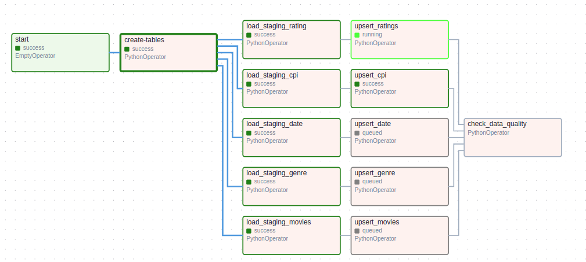

# Movilytics

## Project Description
---
* This is a project to practice skills in using tools to process data, involved with recommending movies to users as a service, as well as investigating certain factors contributing to the success of movies

* The movies data and metadata comes from Movielens, extracted from a Kaggle dataset: https://www.kaggle.com/rounakbanik/the-movies-dataset. The data contains 26 million user ratings of over 270,000 users on a collection of over 45,000 movies.
* In addition, Consumer Price Index of Admission to Movies, Theaters, and Concerts in U.S. City Average is extracted from: https://fred.stlouisfed.org/series/CUSR0000SS62031.

## Architecture

Copy files downloaded from Kaggle and Fred to S3.

Run the ETL pipeline, scheduled using Airflow. Data Processing is done using Spark, and data is eventually ingested into Postgres.

## ETL Pipeline
---
The ETL process runs through an Airflow DAG:  
  
  
  
The process is as follows:
1. Create the tables and staging tables (if not exist)  
2. Perform an update and insert, based on new data coming in  
3. Run a data quality check (check that tables have more than 1 row and there are no null ids)

## Acknowledgements
---
Many thanks to: alanchn31

Reference: https://github.com/alanchn31/Movalytics-Data-Warehouse
